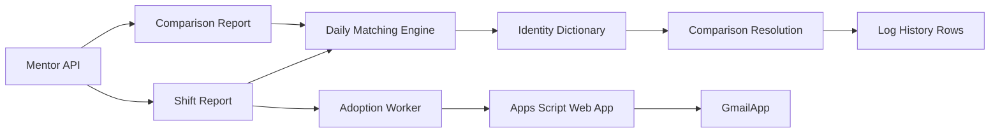

# eMentor Daily Adoption Automation

Production-grade automation project for daily eMentor adoption reporting.

This repository contains a production-quality eMentor automation project. It automates the daily check that compares planned drivers against the eMentor Shift Report, stores the official adoption snapshot, and sends a clean GmailApp report.

- Mentor API session handling with sanitized placeholder endpoints.
- Daily eMentor Shift Report ingestion.
- Google Sheets matching for expected drivers versus completed eMentor checks.
- Identity dictionary learning and conflict detection.
- ADOPTION_HISTORY row preparation.
- Apps Script bridge for daily adoption emails through GmailApp.

No production credentials, private database files, production Google Sheet IDs, Apps Script deployment URLs, real driver data, or real recipient lists are committed.

## Feature Overview

- Mentor login, token refresh, timeout handling, and retry configuration.
- Deterministic matching between expected drivers and eMentor Shift Report rows.
- Identity dictionary learning, confirmation, and conflict quarantine.
- ADOPTION_HISTORY normalization for dashboard persistence.
- Daily adoption automation through Apps Script, Google Sheets, Railway, and GmailApp.
- Tests for matching, identity learning, log-history conversion, Apps Script behavior, and worker behavior.

## Architecture



## Repository Map

```text
src/lib/mentor/
  client.ts                  Mentor API client
  config.ts                  Environment configuration
  session-manager.ts         Login, token refresh, timeout and retry handling
  daily-matching.ts          Deterministic eMentor report matching
  identity-dictionary.ts     Identity learning, confirmation and conflict logic
  comparison-resolution.ts   Resolves comparison rows through the dictionary
  log-history.ts             Converts resolved rows into history records

scripts/
  verify-mentor-auth.mjs     Manual Mentor credential verification
  mentor-adoption-worker.mjs Scheduled daily adoption worker

apps-script/
  adoption.gs                Apps Script Web App bridge
  ementor.gs                 Existing Apps Script matching helpers

tests/
  mentor/           Unit and integration-style tests

docs/
  architecture.md            Technical architecture details
  local-development.md       Local setup instructions
  production-deployment.md   Production deployment checklist
  screenshots/README.md      Screenshot guidance for public docs
  security.md                Public-release and secret-handling checklist
```

## Installation

Requirements:

- Node.js 22+
- npm
- Mentor credentials for live verification
- Google Apps Script project for the adoption bridge

```bash
npm install
cp .env.example .env.local
```

Fill `.env.local` with local values. Never commit it.

## Local Development

Run checks:

```bash
npm run lint
npm test
npm run build
```

Verify Mentor authentication:

```bash
npm run mentor:verify
```

Run the optional adoption worker manually:

```bash
npm run adoption:run -- --run-mode=manual
```

## Configuration

Copy `.env.example` and configure secrets outside git.

Main variables:

- `MENTOR_USERNAME`
- `MENTOR_PASSWORD`
- `MENTOR_COMPANY`
- `MENTOR_BASE_URL`
- `MENTOR_LOG_DATABASE_URL`
- `ADOPTION_WEB_APP_URL`
- `ADOPTION_SHARED_SECRET`
- `TZ`

`MENTOR_LOG_DATABASE_URL` can point to SQLite for local development or PostgreSQL in production.

## Production Deployment

See [Production deployment](docs/production-deployment.md).

## Screenshots

Screenshots are not committed by default because operational images can expose private driver data. See [Screenshot guidance](docs/screenshots/README.md).

## Security

Before publishing, confirm no secrets, local databases, generated files, production URLs, workbook IDs, or real recipient lists are present. See [Security checklist](docs/security.md).

## License

MIT. See [LICENSE](LICENSE).
