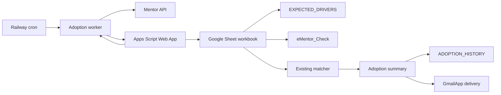
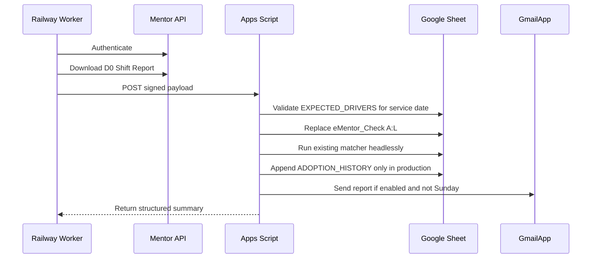

# eMentor Daily Adoption Automation

Public-safe automation for producing a daily eMentor adoption report from:

- Mentor Shift Report data
- Google Sheets expected-driver data
- an existing Apps Script matcher
- Gmail-based report delivery

The repository is intentionally sanitized. It contains no production credentials, no private Google Sheet IDs, no Apps Script deployment URLs, no real driver data, and no real recipient list.

## Feature overview

- Downloads a same-day Mentor Shift Report from a configured Mentor tenant.
- Posts the report to a signed Apps Script Web App endpoint.
- Reuses the workbook’s existing matching rules for expected-vs-completed driver checks.
- Produces station-level and overall adoption statistics.
- Stores one immutable production snapshot per service date.
- Sends the approved HTML report through `GmailApp` when production email is enabled.
- Supports `test`, `manual`, and `production` run modes.
- Includes unit tests for Mentor matching, identity handling, Apps Script behavior, and worker behavior.

## Architecture



## End-to-end workflow



## Repository map

```text
apps-script/
  adoption.gs                Signed Web App endpoint, summary, history, email delivery
  ementor.gs                 Existing matching helpers and manual workflow bridge

scripts/
  mentor-adoption-worker.mjs Scheduled Railway worker
  verify-mentor-auth.mjs     Mentor login/report-access verification

src/lib/
  env.ts                     Small environment helper
  mentor/                    Mentor client, matching, identity, and report helpers

tests/
  mentor/                    Unit and integration-style tests
  mocks/                     Test-only mocks

docs/
  architecture.md            Technical architecture
  apps-script-setup.md       Apps Script setup
  google-sheets-structure.md Workbook structure
  local-development.md       Local development
  production-deployment.md   Deployment checklist
  security.md                Public-release checklist
  screenshots/               Sanitized screenshot guidance
```

## Installation

Requirements:

- Node.js 22+
- npm
- Mentor credentials for live verification
- A Google Sheet workbook with the required tabs
- An Apps Script project deployed as a Web App

Install dependencies:

```bash
npm install
cp .env.example .env.local
```

Fill `.env.local` with private values. Never commit `.env.local`.

## Local development

Run checks:

```bash
npm run lint
npm test
```

Verify Mentor access:

```bash
npm run mentor:verify
```

Run the adoption worker manually:

```bash
npm run mentor:adoption -- --run-mode=manual
```

Run test mode:

```bash
npm run mentor:adoption:test
```

More details are in [docs/local-development.md](docs/local-development.md).

## Configuration

Copy `.env.example` and configure secrets outside git.

Main variables:

- `MENTOR_USERNAME`
- `MENTOR_PASSWORD`
- `MENTOR_COMPANY`
- `MENTOR_BASE_URL`
- `EMENTOR_ADOPTION_WEB_APP_URL`
- `EMENTOR_ADOPTION_SHARED_SECRET`
- `TZ`

Apps Script script properties are documented in [docs/apps-script-setup.md](docs/apps-script-setup.md).

## Google Sheets structure

The workbook remains the operational source of truth. Required tabs include:

- `eMentor_Check`
- `EXPECTED_DRIVERS`
- `ALIAS_TABLE`
- `ADOPTION_HISTORY`
- `ADOPTION_EMAIL_DELIVERY`

See [docs/google-sheets-structure.md](docs/google-sheets-structure.md).

## Apps Script components

The Apps Script layer:

- validates signed worker requests
- validates that expected drivers exist for the service date
- replaces the raw report range
- runs the existing matcher headlessly
- calculates adoption metrics
- appends immutable production history
- sends production email through `GmailApp` when enabled

Manual menu behavior is preserved by keeping the matcher separate from the UI entry points.

## Adoption history

`ADOPTION_HISTORY` stores one immutable production snapshot per service date. Test and manual runs do not write history.

The summary includes:

- service date
- generated timestamp
- run mode
- snapshot time
- overall metrics
- station-level metrics
- missing drivers
- unmatched names
- extra Mentor drivers

## Matching logic

The matcher compares expected drivers from the workbook with Mentor Shift Report rows. At a high level it uses:

- station filtering
- normalized name keys
- manually maintained aliases
- reversed-name handling
- token overlap
- edit-distance checks

The matching rules live in Apps Script and are reused by both manual and headless workflows.

## Production deployment

Production deployment uses:

- Railway for the scheduled worker
- Apps Script Web App for workbook mutation and report generation
- Google Sheets as operational storage
- GmailApp for production email delivery

See [docs/production-deployment.md](docs/production-deployment.md).

## Troubleshooting

Common failure scenarios:

- Mentor login fails: verify Mentor credentials and tenant/company value.
- Shift Report download fails: verify Mentor endpoint access and account permissions.
- Apps Script rejects the payload: verify Web App URL and shared secret.
- Expected drivers are missing: verify the workbook trigger that refreshes `EXPECTED_DRIVERS`.
- Duplicate production run: confirm `ADOPTION_HISTORY` already has the service date; reruns should not append a second snapshot.
- Email not sent: verify production email is enabled, the day is not Sunday, Gmail authorization is granted, and Apps Script execution logs show per-recipient attempts.

## Screenshots

Only sanitized screenshots should be committed. Use demo data and remove browser chrome, real names, email addresses, workbook IDs, deployment URLs, and operational identifiers.

See [docs/screenshots/README.md](docs/screenshots/README.md).

## Security

Before publishing:

1. Confirm no `.env*` files other than `.env.example` are present.
2. Confirm no production Google Sheet IDs, Apps Script URLs, OAuth secrets, Railway variables, or recipient emails are present.
3. Confirm no real driver names, employee IDs, or production aliases are present.
4. Confirm git history does not contain secrets.

See [docs/security.md](docs/security.md).

## Roadmap

- Optional webhook-based delivery confirmation.
- Sanitized example workbook.
- Dashboard examples using generated historical data.
- Additional provider-neutral email transport tests.

## Contributing

See [CONTRIBUTING.md](CONTRIBUTING.md).

## License

MIT. See [LICENSE](LICENSE).
