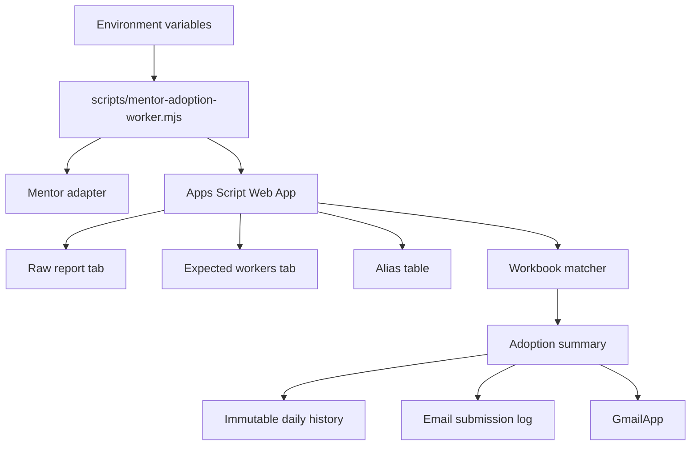

# Architecture

This repository is a production-grade automation project for daily eMentor adoption reporting. It keeps the real system shape visible: a Railway worker downloads the eMentor Shift Report, Apps Script updates Google Sheets, the existing workbook matcher calculates adoption, and GmailApp sends the report.

## Components

## Mentor integration boundary

The public repository keeps the integration understandable without exposing private or undocumented production endpoint paths. The included Mentor client uses example paths only:

- `/auth/login`
- `/auth/refresh`
- `/reports/daily-shifts`

Real production endpoint paths, payload details, credentials, and authentication traces should live outside the public repository.

## Run modes

| Run mode | Purpose | Writes history | Sends configured recipients |
| --- | --- | --- | --- |
| `test` | Preview/test execution | No | No |
| `manual` | Operator-triggered validation | No | No |
| `production` | Official scheduled snapshot | Yes, once per service date | Yes, when enabled and not skipped by schedule config |

## Schedule configuration

The worker and Apps Script support configurable schedule values:

- `REPORTING_TIME_ZONE`
- `REPORTING_OPERATIONAL_RUN_HOUR`
- `REPORTING_OPERATIONAL_RUN_MINUTE`
- `REPORTING_FINAL_RUN_HOUR`
- `REPORTING_FINAL_RUN_MINUTE`
- `REPORTING_SKIP_WEEKDAYS`

The default production targets are 18:15 and 22:30 Europe/Berlin, with Sundays skipped. Railway cron runs the DST-safe UTC candidate times, and the worker guard proceeds only when the local Berlin time is exactly one of the configured report times. The 18:15 operational snapshot sends email but does not write `ADOPTION_HISTORY`; the 22:30 final daily report is the only run that writes `ADOPTION_HISTORY`.

## Public-release boundary

The repository intentionally excludes:

- real credentials
- real provider implementation details
- production Google Sheet IDs
- Apps Script deployment URLs
- real workers/drivers/employees
- real recipient lists
- production screenshots
