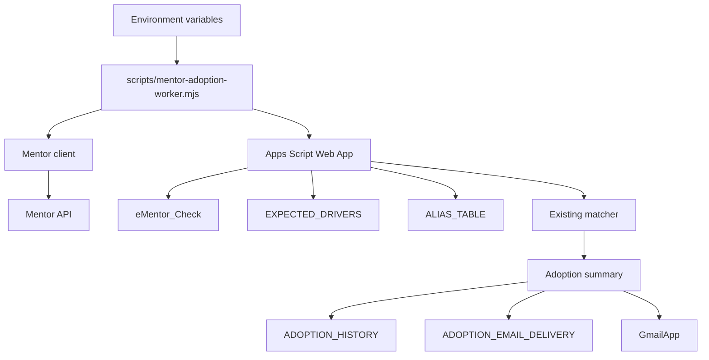
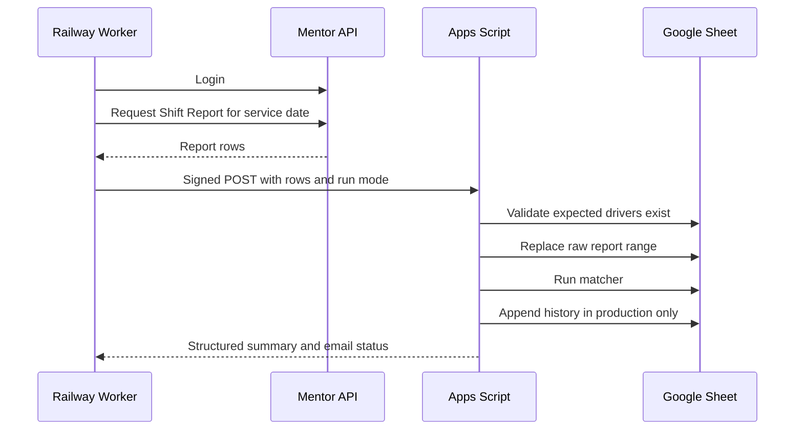

# Architecture

This repository contains a public-safe eMentor adoption automation workflow. It keeps the workbook matcher as the source of truth and automates only the surrounding daily report process.

## Responsibilities

1. Authenticate to Mentor.
2. Download the same-day Shift Report.
3. Submit the report to a signed Apps Script Web App endpoint.
4. Replace the workbook’s raw `eMentor_Check` range.
5. Run the existing matcher headlessly.
6. Calculate overall and station-level adoption metrics.
7. Store one immutable production snapshot per service date.
8. Send the approved HTML report when production email is enabled.

## Component diagram

## Data flow

## Run modes

| Run mode | Purpose | Writes history | Sends production recipients |
| --- | --- | --- | --- |
| `test` | Controlled test and preview runs | No | No |
| `manual` | Operator-triggered validation | No | No |
| `production` | Scheduled official daily snapshot | Yes, once per service date | Yes, when enabled and not Sunday |

## Design rules

- The existing matcher remains the source of truth.
- Expected drivers are not regenerated by the worker.
- Production history is immutable.
- Test and manual runs must not write production history.
- Email is sent per recipient so each submission can be logged separately.
- Secrets are read only from environment variables or Apps Script properties.

## Public release boundary

This repository does not include:

- production Google Sheet IDs
- production Apps Script deployment URLs
- Mentor credentials
- real driver names or employee IDs
- real recipient lists
- production screenshots
- local logs or databases
