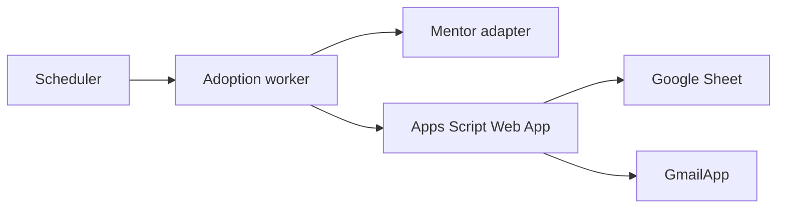

# Production deployment

This guide describes how to deploy the eMentor Daily Adoption Automation safely. It intentionally uses placeholder values instead of production configuration.

## Services



## Worker variables

| Variable | Required | Description |
| --- | --- | --- |
| `MENTOR_USERNAME` | Yes | Mentor username |
| `MENTOR_PASSWORD` | Yes | Mentor password |
| `MENTOR_COMPANY` | If applicable | Mentor tenant/company value |
| `MENTOR_BASE_URL` | Yes | Mentor base URL |
| `MENTOR_LANGUAGE_CODE` | No | Example localization value |
| `MENTOR_REQUEST_TIMEOUT_MS` | No | Request timeout |
| `MENTOR_REQUEST_RETRY_DELAYS_MS` | No | Comma-separated retry delays |
| `ADOPTION_WEB_APP_URL` | Yes | Apps Script Web App endpoint |
| `ADOPTION_SHARED_SECRET` | Yes | Shared secret used to sign payloads |
| `REPORTING_TIME_ZONE` | No | Example default: `Etc/UTC` |
| `REPORTING_RUN_HOUR` | No | Example default: `18` |
| `REPORTING_SKIP_WEEKDAYS` | No | Comma-separated weekday numbers, where `0` is the first day of the week in JavaScript date handling |

## Apps Script properties

| Property | Required | Description |
| --- | --- | --- |
| `ADOPTION_SPREADSHEET_ID` | Yes | Google Sheet ID |
| `ADOPTION_SHARED_SECRET` | Yes | Same shared secret used by the worker |
| `ADOPTION_RAW_IMPORT_SHEET` | No | Raw report tab name |
| `ADOPTION_EXPECTED_SHEET` | No | Expected workers tab name |
| `ADOPTION_ALIAS_SHEET` | No | Alias table tab name |
| `ADOPTION_TIME_ZONE` | No | Reporting timezone |
| `ADOPTION_RUN_HOUR` | No | Reporting hour |
| `ADOPTION_SKIP_WEEKDAYS` | No | Weekday skip config |
| `ADOPTION_PER_RECIPIENT_EMAIL_ENABLED` | Email only | Enable report email |
| `ADOPTION_EMAIL_RECIPIENTS` | Email only | Approved recipient allowlist |

## Commands

```bash
npm run mentor:verify
npm run adoption:run -- --run-mode=manual
npm run adoption:run -- --run-mode=production
npm run adoption:test
```

## Deployment checklist

1. Configure Mentor credentials outside git.
2. Configure Apps Script properties.
3. Deploy Apps Script as a Web App.
4. Run lint and tests.
5. Verify Mentor connectivity.
6. Run a manual adoption execution.
7. Run a controlled email test.
8. Enable scheduled production only after local and mailbox checks pass.

## Rollback

1. Disable the scheduler.
2. Disable production email.
3. Revert the worker deployment.
4. Revert the Apps Script deployment.
5. Rotate exposed secrets if any were leaked.
