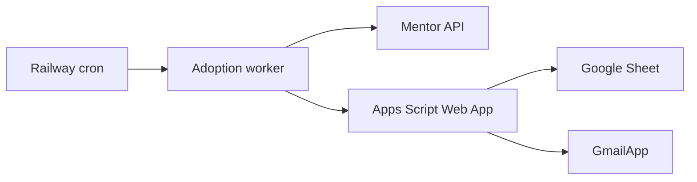

# Production deployment

This guide describes a generic production deployment for the eMentor daily adoption workflow.

Production values must be provided through Railway variables and Apps Script properties. Do not commit production values.

## Recommended services



## Railway environment variables

| Variable | Required | Description |
| --- | --- | --- |
| `MENTOR_USERNAME` | Yes | Mentor API username |
| `MENTOR_PASSWORD` | Yes | Mentor API password |
| `MENTOR_COMPANY` | Yes | Mentor company or tenant value |
| `MENTOR_BASE_URL` | Yes | Mentor API base URL |
| `MENTOR_LANGUAGE_CODE` | No | Defaults to `en` |
| `MENTOR_REQUEST_TIMEOUT_MS` | No | Request timeout |
| `MENTOR_REQUEST_RETRY_DELAYS_MS` | No | Comma-separated retry delays |
| `EMENTOR_ADOPTION_WEB_APP_URL` | Yes | Apps Script Web App endpoint |
| `EMENTOR_ADOPTION_SHARED_SECRET` | Yes | Shared secret used to sign payloads |
| `TZ` | Yes | Use the operational timezone for schedules |

## Apps Script properties

| Property | Required | Description |
| --- | --- | --- |
| `EMENTOR_ADOPTION_SPREADSHEET_ID` | Yes | Google Sheet ID for the adoption workbook |
| `EMENTOR_ADOPTION_SHARED_SECRET` | Yes | Same shared secret used by Railway |
| `EMENTOR_ADOPTION_PER_RECIPIENT_EMAIL_ENABLED` | Production email only | Set to `true` after delivery tests pass |
| `EMENTOR_ADOPTION_EMAIL_RECIPIENTS` | Production email only | Approved recipient allowlist |

## Worker commands

Verify Mentor credentials:

```bash
npm run mentor:verify
```

Run production mode:

```bash
npm run mentor:adoption -- --run-mode=production
```

Run non-production checks:

```bash
npm run mentor:adoption -- --run-mode=manual
npm run mentor:adoption:test
```

## Scheduler

Configure the production schedule in Railway.

Recommended behavior:

- Use the operational timezone.
- Run after the same-day Shift Report is expected to be available.
- Keep Sunday suppression in the worker or Apps Script layer.
- Keep runs idempotent through the immutable `ADOPTION_HISTORY` check.
- Alert operators on repeated failures.

## Apps Script Web App

1. Copy `apps-script/ementor.gs` and `apps-script/adoption.gs` into the Apps Script project attached to the workbook.
2. Set required script properties.
3. Deploy as a Web App.
4. Execute as the account that owns the intended Gmail mailbox.
5. Authorize Sheets and Gmail scopes.
6. Store the Web App URL in Railway.

## Production checklist

1. Install dependencies.
2. Configure Railway environment variables.
3. Configure Apps Script properties.
4. Deploy the Apps Script Web App.
5. Run `npm run lint`.
6. Run `npm test`.
7. Run `npm run mentor:verify`.
8. Run one manual adoption execution.
9. Run one test email to a controlled recipient.
10. Confirm the test appears in Sent and is received.
11. Enable production email.
12. Enable the Railway schedule.

## Rollback

1. Disable the Railway schedule.
2. Disable production email in Apps Script properties.
3. Revert to the previous Apps Script deployment if needed.
4. Revert Railway to the previous deployment if needed.
5. Rotate any exposed secret.
6. Run a manual verification before re-enabling production.
